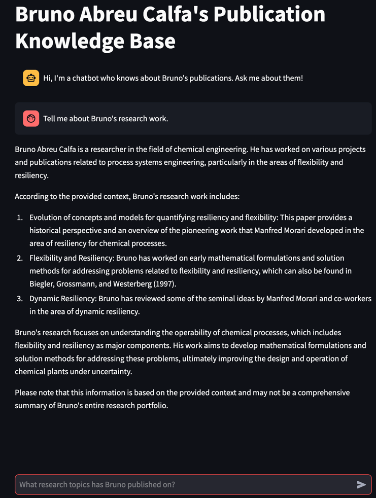
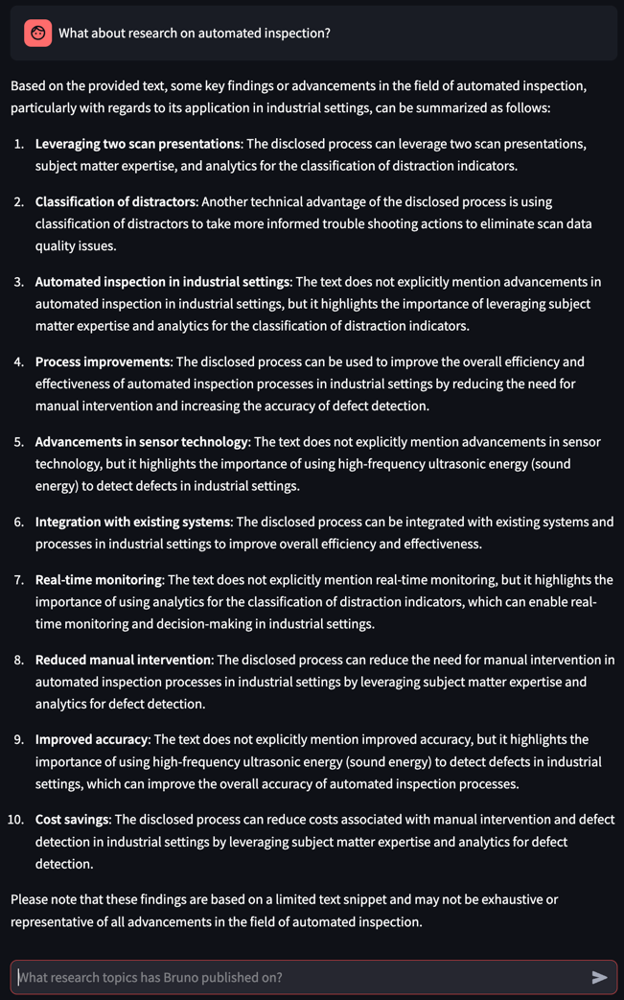
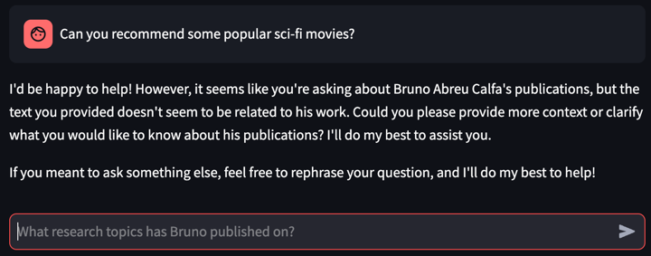

# pubkb
LLM and RAG practice repo: publication knowledge base

Chat-like front-end interface based on [Streamlit](https://streamlit.io/) using a Large Language Model (LLM) in the back-end (locally with [Ollama](https://ollama.com/)) for retrieval-augmented generation (RAG) with chat history support of my publications (papers and patents).

Please reach out if you are interested in obtaining the PDFs of my publications to fully test the program as-is. It expects the PDFs to be located in folder `/pubs`.

- Running locally without Docker
  - Either have [Redis](https://redis.io/) installed and running, or run it from Docker with `docker run -d -p 6379:6379 redis/redis-stack:latest`
  - Run `python -m streamlit run app/main.py`
  - Open web browser
  - Navigate to http://localhost:8501/
- Running with Docker excluding Ollama
  - Create Docker images by running file `docker_compose_local.sh`
  - Open web browser
  - Navigate to http://localhost:8501/
- Running with Docker including Ollama
  - Create Docker images by running file `docker_compose.sh`
  - Open web browser
  - Navigate to http://localhost:8501/

Because I don't have direct access to an NVIDIA GPU, I used the second option above in the demonstrations below. Ollama is installed locally on my iMac and it uses Apple's Metal GPU.

Screenshots from the tool with:
- `llama3:8b` as the LLM
- `nomic-embed-text` as the embedding model

1. General question about my research

2. Question about another research topic

3. Irrelevant question is not answered

